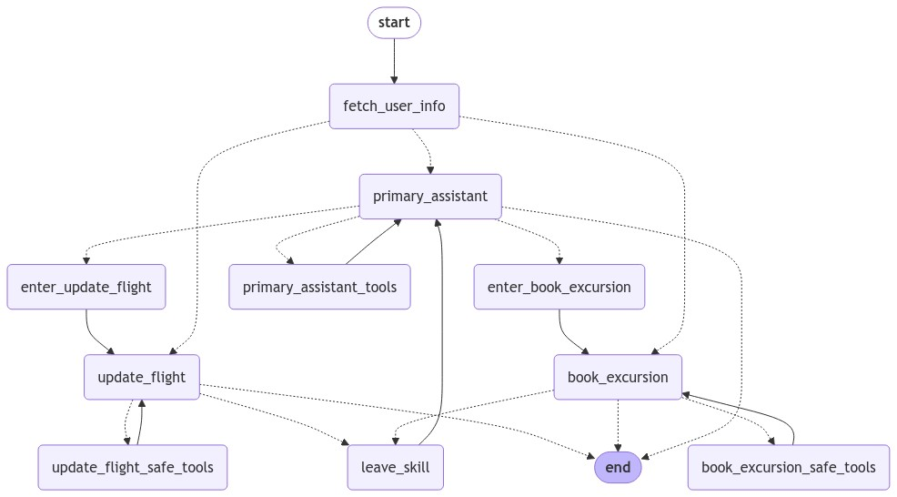

## Customer support bot with specialized workflow agents

Inspired by langchain's [customer support bot](https://github.com/langchain-ai/langgraph/blob/main/examples/customer-support/customer-support.ipynb) example, this streamlit app demonstrates a minimum customer support bot with specialized workflow agents using Langchain's [Langgraph]() and [Langchain]() libraries.

### Workflow agents

- **Primary agent**: This agent is responsible for greeting the user and delegating the user to the appropriate specialized agent based on the user's query.
- **Specialized agents**: These agents are responsible for handling specific types of queries. In this example, we have two specialized agents:
  - **Flight booking agent**: This agent is responsible for handling flight booking queries.
  - **Excursion booking agent**: This agent is responsible for handling excursion booking queries.

### How to run the app

1. Clone the repository:
   ```bash
   git clone
   ```
2. Install the required libraries:
   ```bash
   pip install -r requirements.txt
   ```
3. Add OpenAI API key and Langchain API key to the `.env` file:
    ```bash
    LANGCHAIN_API_KEY=<your_langchain_api_key>
    OPENAI_API_KEY=<your_openai_api_key>
    LANGCHAIN_TRACING_V2=true
    LANGCHAIN_PROJECT=customer-support-bot
    ```
4. Run the app:
   ```bash
   streamlit run main.py
   ```
5. Open the URL displayed in the terminal in your browser.

### How to use the app

1. Enter your query in the text box.

- Example queries:
  - Hi there, what time is my flight?.
  - Am i allowed to update my flight to something sooner? I want to leave later today..
  - Update my flight to sometime next week then.
  - The next available option is great.
  - what about lodging and transportation?.
  - Yeah i think i'd like an affordable hotel for my week-long stay (7 days). And I'll want to rent a car..
  - OK could you place a reservation for your recommended hotel? It sounds nice..
  - yes go ahead and book anything that's moderate expense and has availability..
  - Now for a car, what are my options?.
  - Awesome let's just get the cheapest option. Go ahead and book for 7 days.
  - Cool so now what recommendations do you have on excursions?.
  - Are they available while I'm there?.
  - interesting - i like the museums, what options are there? .
  - OK great pick one and book it for my second day there..


### Agent flow


